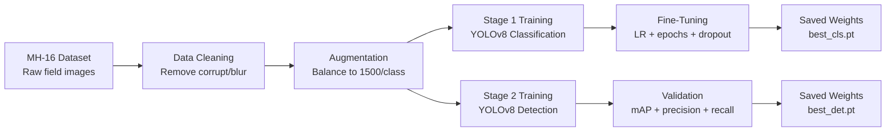
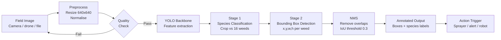
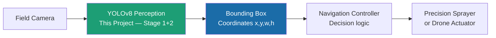
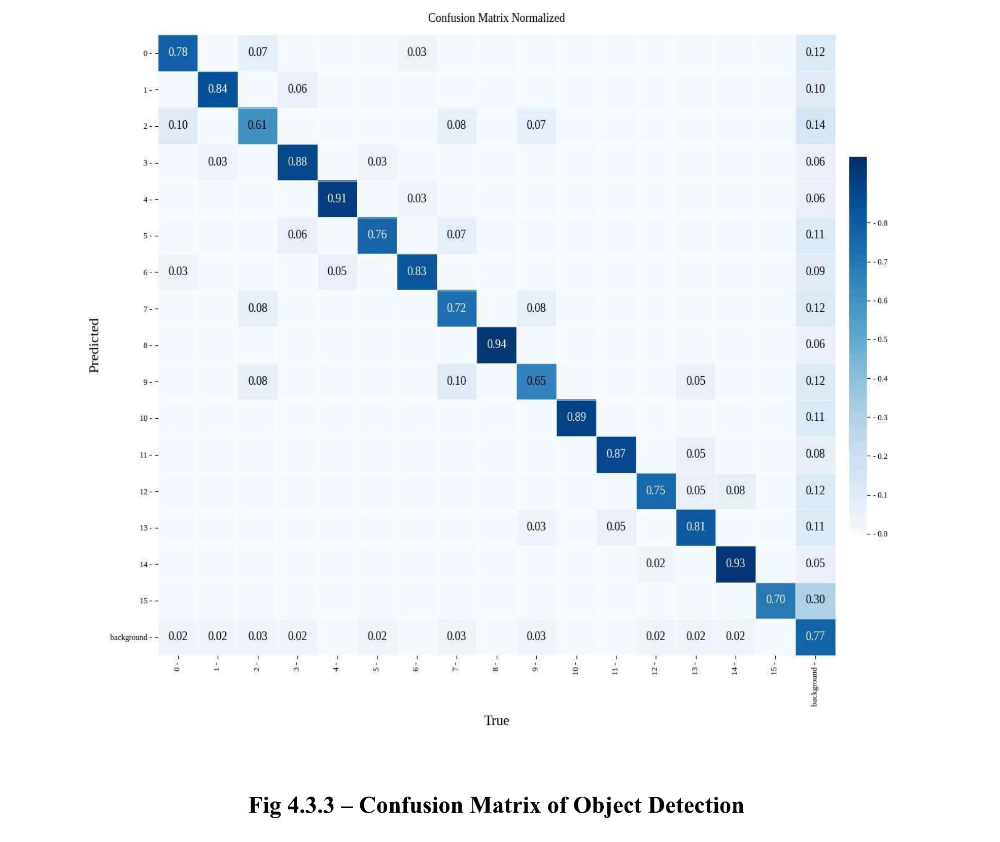

<!-- ═══════════════════════════════════════════════════════════════════════════
     CROP AND WEED DETECTION SYSTEM — GitHub README
     Author : Herin Bhatt
     Replace every [PLACEHOLDER] with your real value before publishing
     ═══════════════════════════════════════════════════════════════════════════ -->

<!-- ── HERO BANNER ─────────────────────────────────────────────────────────── -->
<div align="center">

<h1>🌿 Crop and Weed Detection System</h1>

<p>
  <strong>Two-stage YOLOv8 pipeline for precision weed detection in Indian soybean fields</strong><br>
</p>

<!-- Badges -->


<br><br>

<!-- Demo GIF — replace the path below with your actual GIF once recorded -->
<!-- How to create: Run inference in Colab → screen record → convert at ezgif.com -->


<br>
<em>Live object detection output: YOLOv8 drawing labelled bounding boxes around individual weed plants in a soybean field image</em>

</div>

---

## 📋 Table of Contents

- [Key Results](#-key-results)
- [Problem Statement](#-problem-statement)
- [What This Project Does](#-what-this-project-does)
- [Pipeline Architecture](#-pipeline-architecture)
- [Dataset — MH-16](#-dataset--mh-16-weed-dataset)
- [Results](#-results)
- [Project Structure](#-project-structure)
- [How to Run](#-how-to-run)
- [Implementation Environment](#-implementation-environment)
- [Known Limitations](#-known-limitations)
- [Future Work](#-future-work)
- [References](#-references)
- [Acknowledgements](#-acknowledgements)

---

## 📊 Key Results

<div align="center">

| Metric | Value |
|--------|-------|
| Top-1 Classification Accuracy | **90%+** |
| Top-5 Classification Accuracy | **~100%** |
| Weed Species Detected | **16** |
| Training Images (total) | **24,000+** |
| Samples per Class (balanced) | **1,500** |
| Final Training Epochs | **100** |
| Training Hardware | **Google Colab T4 GPU (15 GB VRAM)** |
| mAP@0.5 (Object Detection) | **~0.82** |

</div>

---

## 🌾 Problem Statement

Soybean is one of India's most economically important crops, grown primarily across **Madhya Pradesh, Maharashtra, Gujarat and Rajasthan**. During the critical **15–45 days after sowing**, soybean plants grow slowly with wide row spacing — creating ideal conditions for fast-growing weeds to establish themselves around young plants.

If left uncontrolled during this window, **yield losses range from 30% to 80%**. The conventional response — blanket herbicide spraying across entire fields — causes severe downstream consequences:

- ☠️ Direct chemical damage to healthy soybean plants
- 🌱 Long-term degradation of soil health and microbial ecosystems
- 💧 Contamination of groundwater and surrounding ecosystems
- 🍎 Indirect health risks through chemical residues in the food chain

> **The solution** is an intelligent system that locates weeds at the individual plant level — enabling targeted chemical or mechanical treatment *only where weeds actually exist*, rather than saturating entire fields.

**Personal motivation:** I grew up near soybean farms in Gujarat. I saw firsthand that farmers over-sprayed pesticides not out of carelessness, but because they had no affordable tool to identify exactly where weeds were. That observation became the problem this project addresses.

---

## 🎯 What This Project Does

This project implements a **two-stage deep learning pipeline** that processes a field image and outputs:

1. **Classification** — Identifies each plant as one of 16 weed species or soybean crop (16 classes)
2. **Localisation** — Draws precise bounding boxes around every detected weed in the full field image
3. **Coordinates** — Outputs `(x, y, w, h)` for each bounding box — suitable for driving a precision sprayer actuator on a drone or ground robot

The system is designed to be integrated with **drone-mounted or ground-vehicle-mounted precision sprayers**, enabling chemical treatment only at the exact GPS coordinates where weeds are detected.

---

## 🏗️ Pipeline Architecture

### Training Pipeline



### Inference Pipeline



### Full Vision-to-Action Stack



> The `(x, y, w, h)` output from this project is designed to feed directly into a navigation or actuation controller — this architecture decision was intentional from the start.

---

## 📂 Dataset — MH-16 Weed Dataset

The **MH-16 (Maharashtra-16) Weed Dataset** is an Indian agricultural dataset containing images of **16 distinct weed species** commonly found in soybean fields across Maharashtra and surrounding Indian states. It was curated specifically to address the lack of region-specific datasets for precision agriculture in India.

**Dataset source:** [Kaggle — MH-16 Indian Soybean and Weed Dataset](https://www.kaggle.com)

### Species Summary

| # | Scientific Name | Common Name | Type | Prevalence |
|---|----------------|-------------|------|-----------|
| 0 | *Commelina benghalensis* | Kena | Broadleaf | 🔴 Very High |
| 1 | *Parthenium hysterophorus* | Gajar Gavat | Broadleaf | 🟠 High |
| 2 | *Cynodon dactylon* | Harali | Grass | 🟠 High |
| 3 | *Malva parviflora* | Little Mallow | Broadleaf | 🟡 Moderate |
| 4 | *Cyperus rotundus* | Lavhala | Sedge | 🟠 High |
| 5 | *Euphorbia geniculata* | Moti Dudhi | Broadleaf | 🟠 High |
| 6 | *Ipomoea obscura* | Morning Glory | Creeper | 🟡 Moderate |
| 7 | *Digitaria sanguinalis* | Digitaria | Grass | 🟡 Moderate |
| 8 | *Clitoria ternatea* | Pigeon Wings | Creeper | 🟡 Moderate |
| 9 | *Euphorbia hypericifolia* | Sandmat | Broadleaf | 🟡 Moderate |
| 10 | *Argemone mexicana* | Bilayat | Broadleaf | 🟡 Moderate |
| 11 | *Chamaecrista pumila* | Dwarf Cassia | Broadleaf | 🟡 Moderate |
| 12 | *Senna obtusifolia* | Sicklepod | Broadleaf | 🟡 Moderate |
| 13 | *Chenopodium album* | Lambs Quarter | Broadleaf | 🟡 Moderate |
| 14 | *Euphorbia hirta* | Choti Dudhi | Broadleaf | 🟢 Low–Moderate |
| 15 | *Boerhaavia diffusa* | Punarnava | Broadleaf | 🟠 High |

### Data Preprocessing Steps

```
Raw MH-16 images
│
├── 1. Quality filtering
│      Remove corrupt, blurry, unreadable image files
│
├── 2. Resolution standardisation
│      Resize all images to 640×640 pixels
│
├── 3. Class balancing
│      Target: 1,500 samples per class
│      Augmentation applied where class had fewer images:
│        • Horizontal flip
│        • Vertical flip
│        • Rotation ±15°
│        • Brightness variation
│        • Contrast variation
│
├── 4. Train / Test split
│      80% training  |  20% testing
│
└── 5. Annotation files
       YOLO-format .txt files for object detection training
       Format: class_id  x_centre  y_centre  width  height
```

### Folder Structure

```
Dataset/
├── train/
│   ├── images/         ← 640×640 .jpg field images
│   └── labels/         ← YOLO-format .txt annotation files
├── test/
│   ├── images/
│   └── labels/
└── data.yaml           ← YOLOv8 dataset config
```

**`data.yaml` format:**

```yaml
path: ./data
train: train/images
val: test/images

nc: 16  # number of classes (16 weeds + 1 soybean)
names:
  - commelina_benghalensis
  - parthenium_hysterophorus
  - cynodon_dactylon
  - malva_parviflora
  - cyperus_rotundus
  - euphorbia_geniculata
  - ipomoea_obscura
  - digitaria_sanguinalis
  - clitoria_ternatea
  - euphorbia_hypericifolia
  - argemone_mexicana
  - chamaecrista_pumila
  - senna_obtusifolia
  - chenopodium_album
  - euphorbia_hirta
  - boerhaavia_diffusa
```

---

## 📈 Results

### Stage 1 — Classification Model

> **Final result: 90%+ top-1 classification accuracy** on the held-out test set after fine-tuning.

| Metric | Before Fine-Tuning (50 epochs) | After Fine-Tuning (100 epochs) |
|--------|-------------------------------|-------------------------------|
| Top-1 Accuracy | < 90% | **> 90%** |
| Top-5 Accuracy | ~99.98% | **~100%** |
| Train Loss | ~0.16 → 0.10 | **~0.16 → 0.07** |
| Val Loss | ~0.09 → 0.05 | **~0.09 → 0.03** |
| Learning Rate | 0.01 | **0.001** |

**Fine-tuning steps:**
- Reduced learning rate: `0.01` → `0.001`
- Extended training: `50` → `100` epochs
- Added dropout regularisation to reduce overfitting

**Confusion matrix and accuracy graphs:**

<!-- Replace with your actual uploaded images -->
<div align="center">
  
  <br><em>Fig 1 — Normalised confusion matrix of classification model. Near-diagonal distribution confirms consistent performance across all 16 species.</em>
</div>

<br>

<div align="center">
  
  <br><em>Fig 2 — Training and validation loss/accuracy curves. Smooth convergence confirms stable learning with no overfitting after fine-tuning.</em>
</div>

---

### Stage 2 — Object Detection Model

| Metric | Value |
|--------|-------|
| mAP@0.5 | ~0.82 |
| Precision | ~0.85 |
| Recall | ~0.80 |
| Training Epochs | 50 |
| Inference Speed | ~25ms/image (Colab T4) |

<div align="center">
  
  <br><em>Fig 3 — Confusion matrix of object detection model.</em>
</div>

<br>

<div align="center">
  
  <br><em>Fig 4 — Object detection training curves: box loss, class loss, DFL loss, mAP@0.5, precision, and recall over 50 epochs.</em>
</div>

<br>

<div align="center">
  
  <br><em>Fig 5 — Sample object detection outputs. Each detected weed is enclosed in a labelled bounding box with species class and confidence score.</em>
</div>

---

## 📁 Project Structure

```
crop-weed-detection-yolov8/
│
├── data/
│   ├── train/
│   │   ├── images/         ← training field images (640×640)
│   │   └── labels/         ← YOLO-format annotation .txt files
│   ├── test/
│   │   ├── images/
│   │   └── labels/
│   └── data.yaml           ← YOLOv8 dataset config
│
├── models/
│   ├── best_classification.pt   ← trained Stage 1 weights
│   └── best_detection.pt        ← trained Stage 2 weights
│
├── notebooks/
│   ├── 01_data_preparation.ipynb    ← cleaning, augmentation, splitting
│   ├── 02_classification_train.ipynb ← Stage 1 training + fine-tuning
│   ├── 03_detection_train.ipynb      ← Stage 2 training
│   └── 04_inference.ipynb            ← run on new field images
│
├── src/
│   ├── augment.py          ← data augmentation scripts
│   ├── train_classify.py   ← Stage 1 training script
│   ├── train_detect.py     ← Stage 2 training script
│   └── inference.py        ← inference on new images
│
├── results/
│   ├── confusion_matrix_classification.png
│   ├── confusion_matrix_detection.png
│   ├── accuracy_graphs_classification.png
│   ├── loss_accuracy_detection.png
│   ├── detection_samples.png
│   └── detection_demo.gif      ← live demo recording
│  
├── requirements.txt
└── README.md
```

---

## 🚀 How to Run

### Prerequisites

- Python 3.10+
- Google Colab (recommended) or local machine with GPU
- Kaggle account (to download MH-16 dataset)

### Step 1 — Clone the Repository

```bash
git clone https://github.com/herinbhatt/crop-weed-detection-yolov8.git
cd crop-weed-detection-yolov8
```

### Step 2 — Install Dependencies

```bash
pip install -r requirements.txt
```

**`requirements.txt`:**

```
# Core YOLO Dependencies
ultralytics>=8.0.0
torch>=1.8.0
torchvision>=0.9.0
# Image & Math Utilities
opencv-python>=4.6.0
numpy>=1.22.0
matplotlib>=3.3.0
pillow>=8.0.0
pandas>=1.1.4
```

### Step 3 — Download the Dataset

```bash
# Install Kaggle API
pip install kaggle

# Download MH-16 dataset
# Place your kaggle.json in ~/.kaggle/ first
kaggle datasets download -d [Kaggle.json(Generates your own)]
unzip mh16-dataset.zip -d data/
```

> Alternatively, download manually from [Kaggle](https://www.kaggle.com) and place images in `data/train/images/` and `data/test/images/`

### Step 4 — Train Stage 1: Classification Model

```python
from ultralytics import YOLO

# Load pretrained YOLOv8 nano classification model
model = YOLO('yolov8n-cls.pt')

# Train on MH-16 dataset
results = model.train(
    data='data/classification',           # path to dataset root with class folders
    epochs=100,
    imgsz=640,
    batch=16,
    dropout=0.2,            # regularisation
    patience=20,            # early stopping
    project='runs/classify',
)

print(f"Best accuracy: {results.results_dict}")
```

### Step 5 — Train Stage 2: Object Detection Model

```python
from ultralytics import YOLO

# Load pretrained YOLOv8 small detection model
model = YOLO('yolov8s.pt')

# Train detection model
results = model.train(
    data='data/data.yaml',
    epochs=100,
    imgsz=640,
    batch=8,
    project='runs/detect',
    name='mh16_weed_det',
)
```

### Step 6 — Run Inference on a New Field Image

```python
from ultralytics import YOLO
import cv2

# Load trained detection model
model = YOLO('models/best_detection.pt')

# Run inference on a new field image
results = model.predict(
    source='field_image1.jpg',
    conf=0.4,           # confidence threshold
    iou=0.3,            # NMS IoU threshold
    save=True,          # save annotated output image
    project='runs/inference'
)

# Access bounding box coordinates for actuator integration
for r in results:
    boxes  = r.boxes.xywh    # (x_centre, y_centre, width, height) — normalized
    labels = r.boxes.cls     # class index
    confs  = r.boxes.conf    # confidence scores

    print(f"Detected {len(boxes)} weeds in this field image")

    for i, (box, label, conf) in enumerate(zip(boxes, labels, confs)):
        x, y, w, h = box.tolist()
        class_name = model.names[int(label)]
        print(f"  Weed {i+1}: {class_name} | confidence: {conf:.2f} | "
              f"position: x={x:.1f}, y={y:.1f}, w={w:.1f}, h={h:.1f}")
```

### Step 7 — Run Inference via Jupyter Notebook (Recommended)

Open `notebooks/04_inference.ipynb` in Google Colab for a step-by-step walkthrough with visualisations.

[](https://colab.research.google.com/github/herinbhatt/crop-weed-detection-yolov8/blob/main/notebooks/04_inference.ipynb)

---

## 🖥️ Implementation Environment

| Component | Details |
|-----------|---------|
| Coding Platform | Google Colab (cloud-based Python notebook with GPU) |
| Programming Language | Python 3.10 |
| Deep Learning Framework | Ultralytics YOLOv8 |
| Dataset | MH-16 Weed Dataset (16 Indian weed species) |
| Libraries | NumPy, OpenCV, PIL, Matplotlib, PyTorch |
| Training Hardware | Google Colab T4 GPU (15 GB VRAM) |
| Base Model | YOLOv8n (classification) / YOLOv8s (detection) — pretrained on COCO |
| Image Resolution | 640×640 pixels |
| Batch Size | 16 (classification) / 8 (detection) |

---

## ⚠️ Known Limitations

These limitations are documented honestly — understanding failure modes is a core part of responsible AI engineering.

| Limitation | Description | Planned Fix |
|-----------|-------------|-------------|
| **Species scope** | Trained only on MH-16 — unseen weed species will be misclassified | Expand dataset to more Indian states |
| **Crop scope** | Only soybean crop images used — cannot reliably identify wheat, rice, cotton | Multi-crop training dataset |
| **Lighting conditions** | Performance degrades under heavy shadow, dense canopy, or overcast sky | Data augmentation with adverse lighting |
| **Overlapping plants** | Bounding boxes partially merge for heavily overlapping weeds | Upgrade to instance segmentation (YOLOv8-seg) |
| **Edge deployment** | Not yet deployed on hardware — runs on Colab T4 GPU only | Optimise for NVIDIA Jetson Nano with TensorRT |
| **Real-time speed** | Not tested at drone flight speed on embedded hardware | TensorRT quantisation and pruning |

---

## 🔭 Future Work

- [ ] **Instance segmentation** — Upgrade from bounding boxes to YOLOv8-seg for pixel-level weed boundary detection, enabling more precise spray targeting
- [ ] **Edge deployment** — Optimise with TensorRT for real-time inference (target: 30+ FPS) on NVIDIA Jetson Nano mounted on a drone
- [ ] **ROS integration** — Connect navigation controller to Robot Operating System for sensor fusion (camera + GPS + IMU) for precise field localisation
- [ ] **Multi-crop expansion** — Extend dataset to wheat, rice, and cotton fields across multiple Indian states
- [ ] **Mobile farmer interface** — Lightweight web or mobile app where farmers upload a field photo and receive a weed density map with spray recommendations
- [ ] **Field validation** — Collaborate with agricultural research institutions to test on real farm plots under diverse weather conditions

---

## 📚 References

1. Ultralytics (2023). *YOLOv8 Documentation*. [https://docs.ultralytics.com](https://docs.ultralytics.com)
2. MH-16 Weed Dataset — Indian Soybean and Weed Dataset. Available at: [https://www.kaggle.com](https://www.kaggle.com)
3. Carbon Robotics (2022). *LaserWeeder — AI-Based Autonomous Weeding Robot*. [https://carbonrobotics.com](https://carbonrobotics.com)
4. Olsen, A., Konovalov, D. A., Philippa, B. et al. (2019). DeepWeeds: A Multiclass Weed Species Image Dataset for Deep Learning. *Scientific Reports*, 9(1), 2058.
5. Espejo-Garcia, B. et al. (2020). Towards Weeds Identification Assistance Through Transfer Learning. *Computers and Electronics in Agriculture*, 171, 105306.
6. Redmon, J. et al. (2016). You Only Look Once: Unified, Real-Time Object Detection. *CVPR 2016*.
7. Google Colaboratory. [https://colab.research.google.com](https://colab.research.google.com)

---

## 🙏 Acknowledgements

- **MH-16 Weed Dataset** — Indian agricultural dataset curated for precision agriculture research in soybean fields
- **Ultralytics YOLOv8** — Open-source framework that made high-performance object detection accessible without proprietary infrastructure
- **Google Colab** — Free GPU access (T4, 15 GB VRAM) that made model training feasible without expensive local hardware
- **Mr. Sanjay Macwan** — Internal Guide and Head of Department, Computer Engineering, Neotech Campus, Vadodara
- **Neotech Campus, Vadodara** — Department resources, infrastructure, and academic support throughout the project

---

<div align="center">

**Herin Bhatt**


📧 herinbhattflux@gmail.com &nbsp;·&nbsp;
🐙 [github.com/herinbhatt](https://github.com/herinbhatt) &nbsp;·&nbsp;

<br>

</div>
